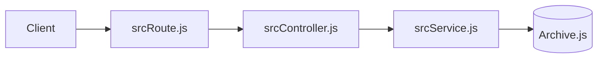
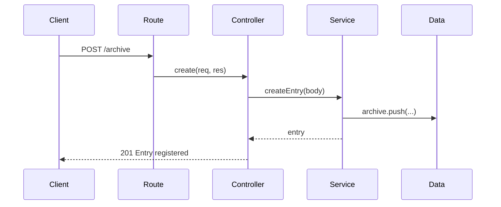
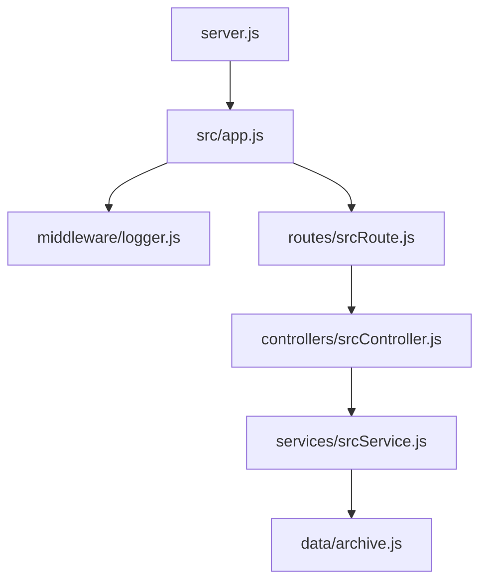

## Arkitektur

```mermaid
flowchart LR
    Client[Client] --> Routes[srcRoute.js]
    Routes --> Controller[srcController.js]
    Controller --> Service[srcService.js]
    Service --> Archive[(Archive.js)]
```

```mermaid
sequenceDiagram
    Client->>Route: POST /archive
    Route->>Controller: create(req, res)
    Controller->>Service: createEntry(body)
    Service->>Data: archive.push(...)
    Service-->>Controller: entry
    Controller-->>Client: 201 Entry registered
```

```mermaid
flowchart TD
    Server[server.js] --> App[src/app.js]
    App --> Logger[middleware/logger.js]
    App --> Routes[routes/srcRoute.js]
    Routes --> Controller[controllers/srcController.js]
    Controller --> Service[services/srcService.js]
    Service --> Data[data/archive.js]
```
